# Signal Detection and Classification in Shared Spectrum: A Deep Learning Approach

This readme file is an outcome of the [CENG501 (Spring 2021)](http://kovan.ceng.metu.edu.tr/~sinan/DL/) project for reproducing a paper without an implementation. See [CENG501 (Spring 2021) Project List](https://github.com/sinankalkan/CENG501-Spring2021) for a complete list of all paper reproduction projects.

# 1. Introduction

In this project, implementation of a signal classifier with the combination of Convolutional and Recurrent Neural Networks as described in the paper[1] is tried. The paper is accepted for publishing in [IEEE INFOCOM 2021 Main Conference](https://infocom2021.ieee-infocom.org/accepted-paper-list-main-conference).

## 1.1. Paper summary

Authors of the paper develop a deep neural network for classification of coexisting signal types such as IEEE802.11 (WiFi), LTE (Long Term Evolution) and 5G-NR (5G New Radio). Also, this network works on directly received signal's I/Q (In-Phase and Quadrature) samples meaning that receiver side does not have to decode the received signal in order to detect its type. The proposed architecture combines both CNN and RNN and uses segment of I/Q samples for training. It is trained in both simulation environment and experimental environment with the trasmitter and receiver hardware. Their results show that proposed architecture can achieve accurate classification in both environments.

WiFi, LTE and 5G-NR signals can coexist in the shared spectrum (5-6 GHz) so assesment of the wireless environment is crucial in terms of better communication. In the paper, there are 7 classes for the classification task: WiFi, LTE, 5G, WiFi+LTE, WiFi+5G, LTE+5G, WiFi+LTE+5G

Authors compare their architecture with other machine and deep learning architectures such as SVM (Support Vector Machine), RF (Random Forests), CNN (Convolutional Neural Networks) and LSTM (Long Short-Term Memory) and the proposed architecture shows better performance in the classification task. The authors also try to improve the architecture's accuracy by introducing Frequency-Domain Analysis (FDA) into the input segment. They exhibit extensive analysis on the impact of FDA, RNN layer, and segment length. Also, they show their analysis on SNR (Signal-to-Noise Ratio) and receiver antenna gains.

# 2. The method and my interpretation

## 2.1. The original method

### 2.1.1 Data Generation

The wavefroms are generated with *MATLAB Communication Toolbox* and *5G Toolbox* with different set of signal features such as channel bandwidth, modulation and coding scheme, subcarrier spacing, allocated resource blocks etc. Signal features can be seen in the *Table I*. The generated waveforms are transmitted by three transmitter antennas and received by one receiver antenna. Each transmitter antenna is responsible for one signal type and the receiver system collects received signal's raw I/Q values. Then, 512 consequent I/Q pairs are saved together as a segment. There are approximately 100,000 segments are used in training and testing the classifier. The dataset is split into 80% for training and %20 for testing. Experimental setup of the authors can be seen in *Figure 10*. Also, they introduce additive white Gaussian noise (AWGN) channel model with different SNR values to the data in order to simulate the noise in the wireless environment.

<table style="margin-left:auto; margin-right:auto">
    <tr>
        <td>

            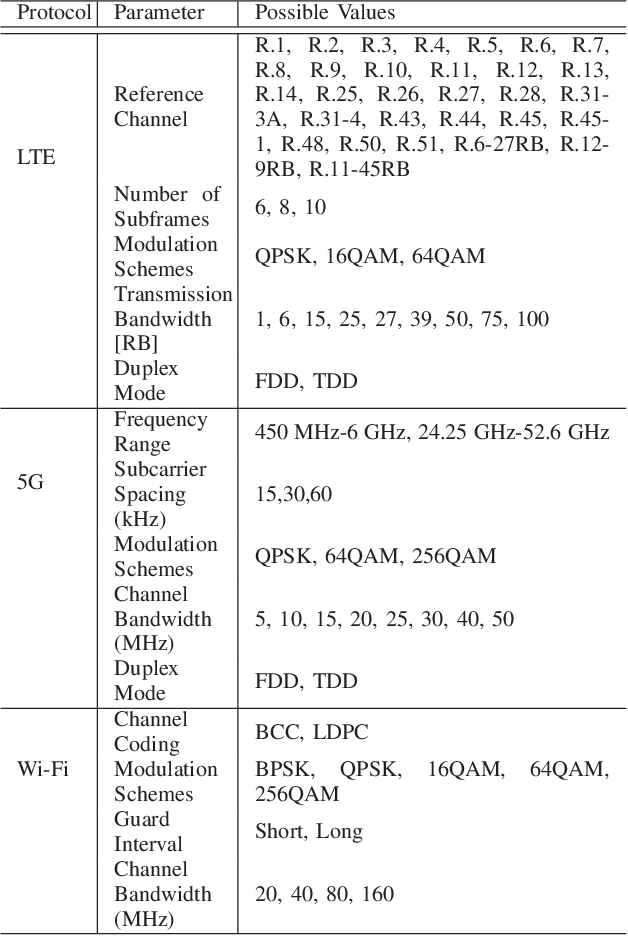
             Table I from the paper: Parameter Options for Waveform Generator 
        
</td>
        <td>

            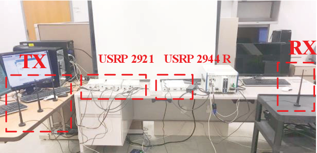
             Figure 10 from the paper: Experiment setup used for performance evaluation 
        
</td>
    </tr>
</table>

### 2.1.2 CNN-LSTM Architecture

Proposed architecture can be seen from the *Figure 2*. STFT (Short-Time Fourier Transform) is applied to the segmented sequence of 512 I/Q pairs with Kaisar-Bessel window function and this is fed into convolutional layer, and then pooling layer. Convoluted and pooled input is flattened and further fed into LSTM layer. Output of the LSTM layer is passed to dense layer and then softmax layer.

<table style="margin-left:auto; margin-right:auto">
    <tr>
        <td>

            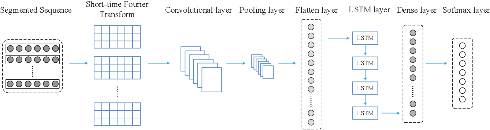
             Figure 2 from the paper: Overview of the proposed FDA-CNN-LSTM classifier 
        
</td>
    </tr>
</table>

In the paper, there are no information about the depth of the network, number of the layers, layout of the layers, number of the layers, number of the hidden neurons in LSTM or Dense layers, training such as learning rate, optimizer, epochs, batch size, loss curves etc. Scaled Exponential Linear Unit (SELU) [2] is used as an activation function in order to avoid vanishing gradient problem. SELU can be seen in *Equation 7*, **α ≈ 1.6733** and **λ ≈ 1.0507**.

<table style="margin-left:auto; margin-right:auto">
    <tr>
        <td>

            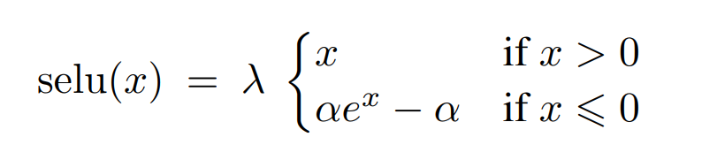
             Equation 7 from [2]: Scaled Exponential Linear Unit (SELU) 
        
</td>
    </tr>
</table>

STFT with Kaisar-Bessel window function is applied to the input segmsents with 512 I/Q pairs; however, there are no information about the window length, shape factor and side-lobe attenuation.

I/Q samples are from the time-domain and its frequency-domain information is obtained by applying STFT.

One of the unmentioned information is about input size and this was one of the hardest part of this project. Generated I/Q data is a complex number; therefore, it's real part (I) and imaginary part (Q) is split such that one segment can be in the shape of `(512,)` or `(2, 512)`.

## 2.2. My interpretation 

### 2.2.1 Data Generation

Authors are used hardware (three NI USRP-2921s and one NI USRP-2944R) for creating the dataset by transmitting and receiving WiFi, LTE and 5G waveforms. Since, I do not have any equipment for waveform transmission and reception, I generated data directly within the *MATLAB* and was able to generate pure signals (WiFi, LTE and 5G without coexistencing).

I used *WLAN Toolbox*, *LTE Toolbox* and *5G Toolbox* in *MATLAB R2021a* to generate waveforms with AWGN. Waveforms are generated with every possible waveform combinations (which might be more extensive than the project's waveform parameters). For the implementation, approximately 45,000 segments are generated: 14,410 WiFi, 13,972 LTE and 16,170 5G segments. The number of generated segments can be easily increased. Visualization of 256 I/Q pairs can be seen below.

<table style="margin-left:auto; margin-right:auto">
    <tr valign="top">
        <td>

            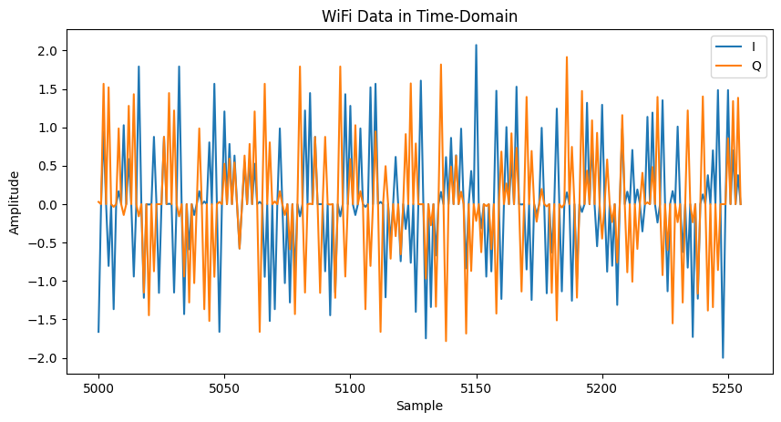
             Generated WiFi Data in Time-Domain 
        
</td>
        <td>

            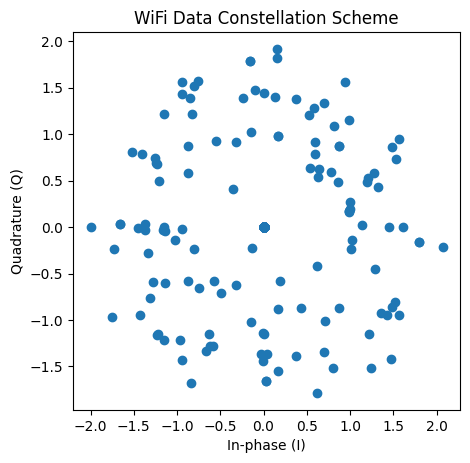
             Generated WiFi Data Constellation Scheme 
        
</td>
        <td>

            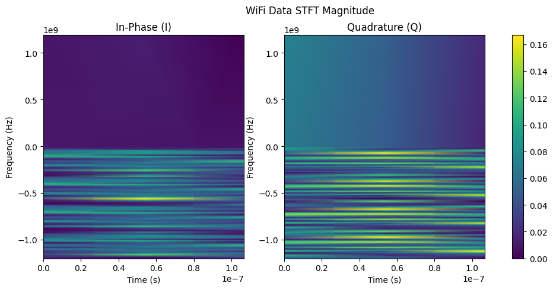
             Generated WiFi Data with FDA 
        
</td>
    </tr>
    <tr valign="top">
        <td>

            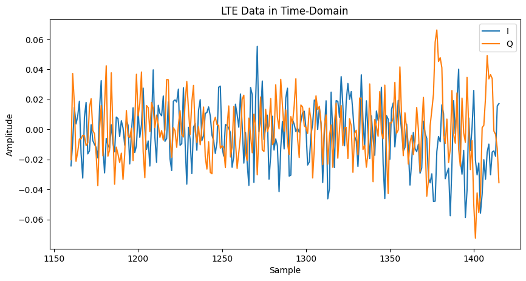
             Generated LTE Data in Time-Domain 
        
</td>
        <td>

            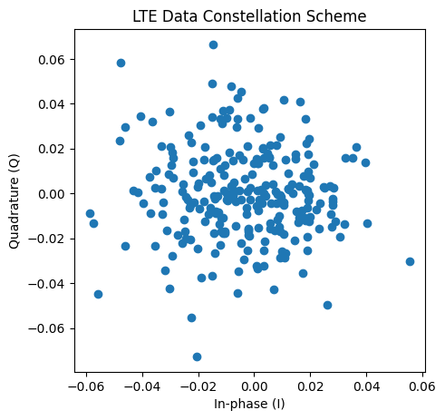
             Generated LTE Data Constellation Scheme 
        
</td>
        <td>

            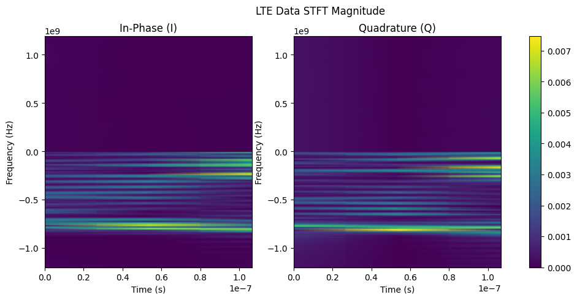
             Generated LTE Data with FDA 
        
</td>
    </tr>
    <tr valign="top">
        <td>

            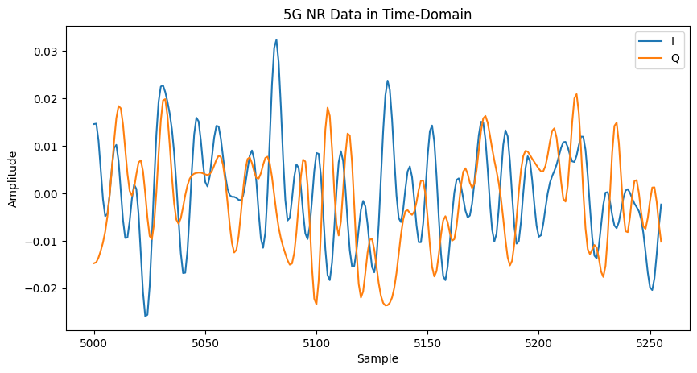
             Generated 5G Data in Time-Domain 
        
</td>
        <td>

            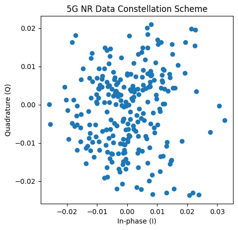
             Generated 5G Data Constellation Scheme 
        
</td>
        <td>

            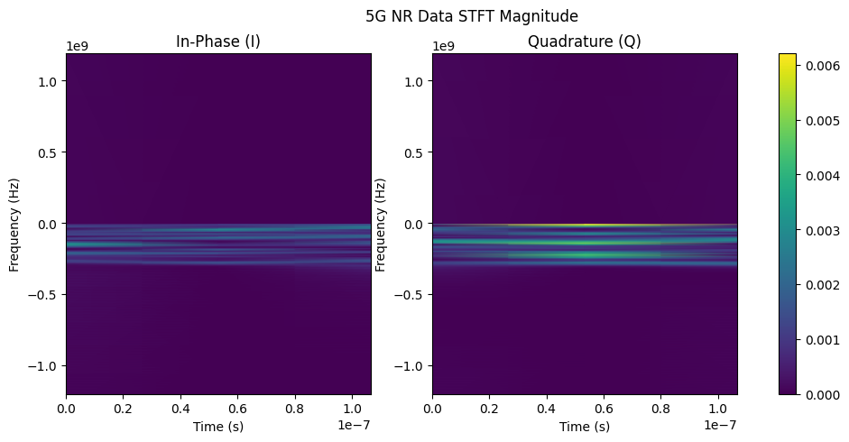
             Generated 5G Data with FDA 
        
</td>
    </tr>
    <tr valign="top">
        <td colspan="3">

            Generated Data's Visualizations
        
</td>
    </tr>
</table>

### 2.2.2 CNN-LSTM Architecture

Since there are information about only activation function which is SELU, I had to improvised the network's design. In the paper, the proposed architecture is compared against CNN and LSTM models, so I also implemented pure CNN and LSTM models for comparing them with the proposed CNN-LSTM model.

As I mentioned, input shape was the puzzling part of this project since the I/Q value is a complex number. For example, a batch of segments with the shape of `(B, 512)` with complex numbers can be reshaped into to the following shapes before fed into to the model:

* `(B, 1, 512, 2)`: Real (I) and imaginary (Q) values are in the width dimension.
* `(B, 2, 512, 1)`: Real (I) and imaginary (Q) values are in the channel dimension.
* `(B', L, 512, 2)`: *L* different segments are used where *L* is the sequence number. Real (I) and imaginary (Q) values are in the width dimension.

But what about STFT of the segments? STFT of a batch of segments is in the shape of `(B, 512, 3)` with complex values. Therefore, it can be reshaped into to the following shapes before passed into the model:

* `(B, 3, 512, 2)`: Real (I) and imaginary (Q) values are in the width dimension.
* `(B, 2, 512, 3)`: Real (I) and imaginary (Q) values are in the channel dimension.
* `(B', L, 512, 6)`: *L* different segments are used where *L* is the sequence number. Real (I) and imaginary (Q) values are flattened into the width dimension.

In order to decide which shape is better in terms of classification accuracy, I tried different shapes of input.

# 3. Experiments and results

## 3.1. Experimental setup

The proposed architecture

## 3.2. Running the code

Explain your code & directory structure and how other people can run it.

## 3.3. Results

Present your results and compare them to the original paper. Please number your figures & tables as if this is a paper.

# 4. Conclusion

Discuss the paper in relation to the results in the paper and your results.

# 5. References

[1]: [Zhang, W., Feng, M., Krunz, M., & Abyaneh, A. (2020). Signal Detection and Classification in Shared Spectrum: A Deep Learning Approach. *IEEE INFOCOM 2021*.](http://wireless.ece.arizona.edu/sites/default/files/Infocom_2021_wenhan.pdf)

[2]: [Klambauer, G., Unterthiner, T., Mayr, A. & Hochreiter, S. (2017). Self-Normalizing Neural Networks.](https://arxiv.org/abs/1706.02515)

# Contact

Berker Acır - berker.acir@metu.edu.tr, berkeracir159@gmail.com
